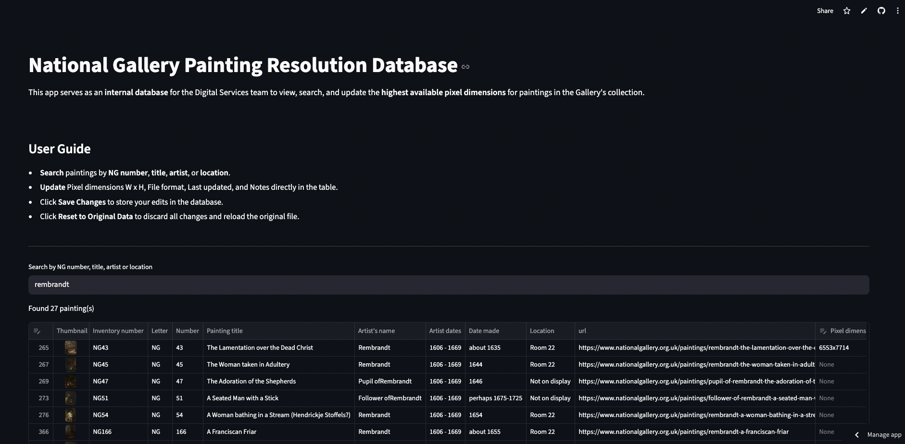

# National Gallery Painting Resolution Database

An internal web app for the Digital team to view, search, and update the highest pixel dimensions for paintings in the collection. Built with Streamlit, it provides a fast, user-friendly interface for managing and editing painting metadata.

## Features
- View a table of paintings from an csv file
- Search paintings by title, artist, inventory number, or location
- Edit only specific columns (Pixel dimensions W x H, File format, Last updated)
- Save changes to a new csv file
- Reset to the original data at any time

## Screenshot


*Example: Main interface with search and editable table.*

## Requirements
- Python 3.8+
- Streamlit
- pandas

## Setup
1. **Clone the repository**
2. **Install dependencies**
   - Using pip:
     ```bash
     pip install streamlit pandas
     ```
   - Or using pipenv:
     ```bash
     pipenv install
     pipenv shell
     pipenv install streamlit pandas
     ```

## Usage
Run the app with:
```bash
streamlit run app.py
```

- Use the search box to filter paintings.
- Edit allowed columns directly in the table.
- Click "Save Changes" to save edits to `data/updated-painting-resolution-list.csv`.
- Click "Reset to Original Data" to discard edits and reload the original file.

## License
MIT